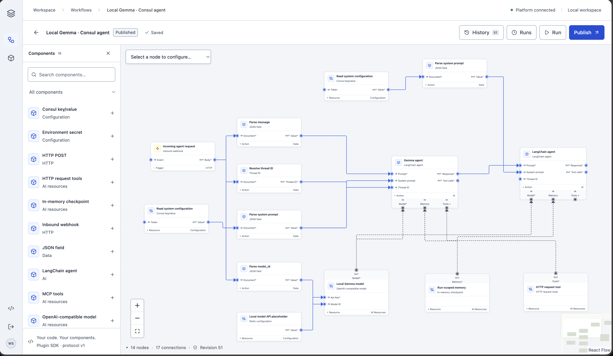

# Forma — Workflow Studio

A Go-served Vite/React workflow editor with PostgreSQL 18 state, immutable revision history, and independently packaged Python plugins. Adapted from Brian's local BKit API template; uses bconfig, bsuite/bdb, brun, baccess, and btelemetry. No integration is compiled into the platform.

## Workflow View



## Run locally

```sh
make configure
docker compose up -d --build
```

Open http://127.0.0.1:8080. Use the `PLATFORM_ACCESS_TOKEN` from the local `.env` file. The file is generated once with mode 0600 and unique credentials; existing values are retained. Keep the encryption key backed up with the platform database. Replacing it makes existing encrypted run data and sessions unreadable.

The supplied Compose stack binds ports to loopback only. It runs PostgreSQL, the Go platform/UI, the Python worker, and an OpenTelemetry Collector. The collector exports all three signals to its local debug output for inspection. Configure your actual observability backend in `deployments/otel-collector.yaml` before sustained use.

## Build and inspect

- Go 1.25 or newer; Node 22.22 or newer; npm; uv/Python 3.12 or newer.
- `make build`: build the Vite assets and Go binary.
- `make lint`: Go vet and frontend ESLint.
- `make plugins`: validate installed plugin artifact digests.
- `docker compose ps`: service health.
- `docker compose logs collector`: exported traces, metrics, and logs.
- `docker compose logs platform worker`: startup/runtime errors.

No automated tests have been added; the repository owner's approval is required before writing them.

## Using the editor

- Select a node, then use **Inputs & resources** to select existing sources or add a model, memory, MCP, credential, or configuration component.
- Use **Configure** and **Used by** to move between a resource and its consumer.
- Multiple tool sources are supported by agent plugin version 1.1.0; existing versions remain pinned until explicitly upgraded.
- For incoming requests, add **Inbound webhook**, create its **Test endpoint**, and choose **Copy curl command**. Publish before creating its **Live endpoint**.
- Test requests appear in **Runs** and in the trigger's received-request status.

## Main capabilities

- Manifest-driven catalog, typed connection ports, schema-driven configuration, and diagnostic field controls.
- PostgreSQL-backed autosave with optimistic concurrency checks; a failed save remains visibly unsaved.
- Immutable revision snapshots, full workflow restore, single-node configuration restore, and explicit publication.
- Durable run queue, fenced leases, encrypted inputs and checkpoints, retries, run/step status, and cancellation.
- Separate packages for static configuration, encrypted static credentials, secret references, Vault KV v2, Consul KV, OpenAPI operations, inbound webhooks, outbound POST, LangChain agents, OpenAI-compatible models, MCP tools, and external PostgreSQL memory.
- SDK scaffolding and OpenAPI-to-plugin import.

See [local verification results](docs/verification.md) for completed checks and remaining service validation.

See [the plugin SDK guide](docs/plugin-sdk.md) for contracts, authoring, composition, observability, supported semantics, and limitations. See [architecture](docs/architecture.md) and [operations](docs/operations.md) for persistence and deployment.

## Layout

| Path | Purpose |
| --- | --- |
| `cmd/api` | Go service lifecycle |
| `internal/platform` | PostgreSQL, revisions, validation, encryption |
| `internal/execution` | Durable scheduler and worker protocol client |
| `internal/server` | Authenticated APIs, generic trigger transport, Vite asset serving |
| `sdk/go/plugin` | Language-neutral wire types |
| `python/workflow_sdk` | Plugin runtime, telemetry, resource resolution, package tooling |
| `plugins/*` | Independently versioned integration packages |
| `web/src` | Vite/React/React Flow UI |
| `deployments` | OpenTelemetry configuration and collector image |

Node configuration is encrypted at rest inside new revision snapshots. Use the Static credential plugin for directly entered credentials, or Environment secret/Vault for externally managed credentials. Static credential marks its output sensitive and masks its editor field. Sensitive results are encrypted in execution storage and are not returned by the run inspection API. Authorized workspace readers can retrieve decrypted configuration through the API; assign roles only to trusted workspace members.

### Local Gemma and Consul workflow

See [the local agent walkthrough](docs/local-agent.md) for the published webhook workflow, request payload, Consul keys, plugin versions, and verification results.
